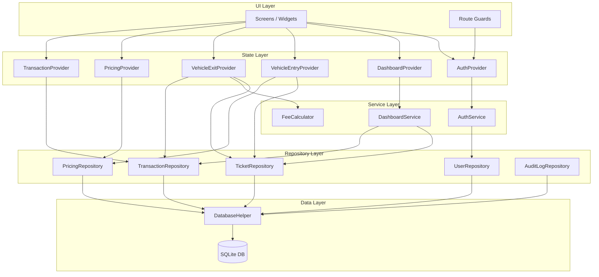
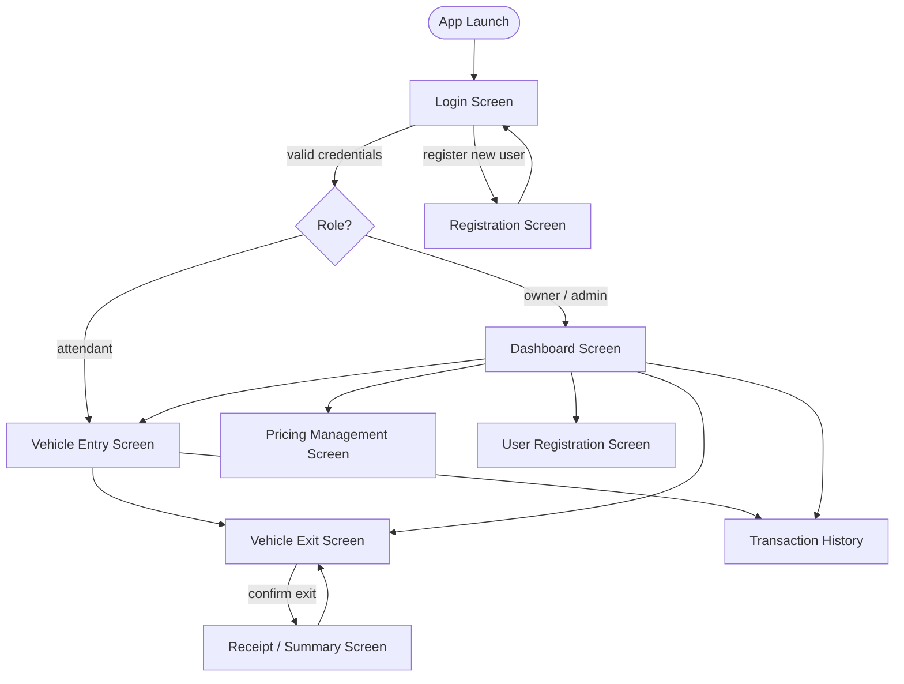

# Design Document — Parking System

## Overview

The Parking System is a Flutter mobile application that digitizes parking lot operations for small operators. It runs entirely on-device with a local SQLite database — no backend server is required. The app supports two roles (owner/admin and attendant), manages the full vehicle entry-to-exit lifecycle, calculates fees from configurable pricing rules, and surfaces real-time metrics on a dashboard.

### Design Goals

- **Offline-first**: All data lives in a local SQLite database; the app functions without network connectivity.
- **Centralized fee logic**: A single `FeeCalculator` service owns all fee computation; no rates are hardcoded in widgets or repositories.
- **Immutable audit trail**: Transaction records are insert-only; no UPDATE or DELETE is ever issued against the transactions table.
- **Role-gated navigation**: Route guards evaluate the session role on every navigation event; unauthenticated or under-privileged requests are redirected immediately.
- **Snapshot-based pricing**: The pricing rule in effect at entry time is snapshotted onto the ticket so that subsequent rule changes never affect open sessions.

---

## Architecture

The application follows a layered architecture with strict dependency direction: Widgets → Services/Providers → Repositories → DatabaseHelper.



### Layer Responsibilities

| Layer | Responsibility |
|---|---|
| **UI Layer** | Render screens, capture user input, display state from providers. No business logic. |
| **State Layer** | Providers (Riverpod) hold screen-level state, call services/repositories, expose streams/notifiers to widgets. |
| **Service Layer** | Stateless business logic: authentication, fee calculation, dashboard aggregation. |
| **Repository Layer** | All SQLite access. Parameterized queries only. Widgets and services never touch `sqflite` directly. |
| **Data Layer** | `DatabaseHelper` owns schema creation, versioning, and migrations. |

---

## Components and Interfaces

### DatabaseHelper

Singleton responsible for opening the database, running `onCreate`/`onUpgrade`, and exposing the `Database` instance to repositories.

```dart
class DatabaseHelper {
  static const String _dbName = 'parking_system.db';
  static const int _dbVersion = 1;

  static final DatabaseHelper instance = DatabaseHelper._internal();
  DatabaseHelper._internal();

  Database? _database;

  Future<Database> get database async;
  Future<Database> _initDatabase() async;
  Future<void> _onCreate(Database db, int version) async;
  Future<void> _onUpgrade(Database db, int oldVersion, int newVersion) async;
}
```

### Repositories

All repositories accept a `DatabaseHelper` instance (constructor injection) and expose only `async` methods.

```dart
abstract class UserRepository {
  Future<User?> findByUsername(String username);
  Future<int> insert(User user);
  Future<void> updateLockStatus(int userId, bool locked);
  Future<void> updateFailedAttempts(int userId, int count);
}

abstract class TicketRepository {
  Future<int> insert(Ticket ticket);
  Future<Ticket?> findOpenByPlate(String plateNumber);
  Future<List<Ticket>> findAllOpen();
  Future<void> closeTicket(int ticketId, DateTime exitTime, String closedBy);
}

abstract class TransactionRepository {
  Future<int> insert(ParkingTransaction transaction); // INSERT only — no update/delete
  Future<List<ParkingTransaction>> query(TransactionFilter filter);
  Future<ParkingTransaction?> findById(int id);
}

abstract class PricingRepository {
  Future<int> insert(PricingRule rule);
  Future<PricingRule?> findDefault();
  Future<List<PricingRule>> findAllActive();
  Future<void> update(PricingRule rule);
  Future<void> setDefault(int ruleId);
  Future<void> deactivate(int ruleId);
}

abstract class AuditLogRepository {
  Future<void> log(AuditEvent event);
}
```

### Services

```dart
class AuthService {
  Future<AuthResult> register(RegisterRequest request);
  Future<AuthResult> login(LoginRequest request);
  Future<void> logout(int userId);
  Future<void> unlockAccount(int userId);
}

class FeeCalculator {
  /// Pure function — no I/O. Takes a PricingRule snapshot and duration in minutes.
  Money calculate(PricingRule rule, int durationMinutes);
}

class DashboardService {
  Future<DashboardMetrics> computeMetrics();
}
```

### Providers (Riverpod)

```dart
// Session state — available app-wide
final authProvider = StateNotifierProvider<AuthNotifier, AuthState>(...);

// Feature-scoped providers
final dashboardProvider = FutureProvider<DashboardMetrics>(...);
final vehicleEntryProvider = StateNotifierProvider<VehicleEntryNotifier, VehicleEntryState>(...);
final vehicleExitProvider  = StateNotifierProvider<VehicleExitNotifier, VehicleExitState>(...);
final pricingProvider      = StateNotifierProvider<PricingNotifier, PricingState>(...);
final transactionProvider  = StateNotifierProvider<TransactionNotifier, TransactionState>(...);
```

### Route Guard

A `RouterNotifier` (or `GoRouter` redirect callback) checks `authProvider` on every navigation event. If the session is absent or the role is insufficient for the target route, the user is redirected to `/login` or `/vehicle-entry` respectively.

```dart
String? _redirect(BuildContext context, GoRouterState state) {
  final auth = ref.read(authProvider);
  if (auth is Unauthenticated) return '/login';
  if (_isAdminRoute(state.location) && auth.role == Role.attendant) {
    return '/vehicle-entry'; // with access-denied message
  }
  return null;
}
```

---

## Data Models

### Dart Models

```dart
// lib/models/user.dart
class User {
  final int? id;
  final String username;
  final String passwordHash;
  final Role role;
  final bool isLocked;
  final int failedAttempts;
  final DateTime createdAt;
}

enum Role { owner, attendant }

// lib/models/pricing_rule.dart
class PricingRule {
  final int? id;
  final String name;
  final RateType rateType;
  final double rateAmount;       // stored as INTEGER cents in DB
  final int gracePeriodMinutes;  // 0 = no grace period
  final double? dailyMaxCap;     // null = no cap; stored as INTEGER cents
  final bool isActive;
  final bool isDefault;
}

enum RateType { hourly, flat }

// lib/models/ticket.dart
class Ticket {
  final int? id;
  final String plateNumber;
  final DateTime entryTime;       // UTC
  final DateTime? exitTime;       // UTC; null = open ticket
  final int pricingRuleId;
  // Snapshot fields — copied from PricingRule at entry time
  final String pricingRuleName;
  final RateType rateType;
  final double rateAmount;
  final int gracePeriodMinutes;
  final double? dailyMaxCap;
  final String createdBy;         // username of attendant
  final String? closedBy;         // username of attendant who processed exit
}

// lib/models/parking_transaction.dart
class ParkingTransaction {
  final int? id;
  final int ticketId;
  final String plateNumber;
  final DateTime entryTime;
  final DateTime exitTime;
  final int durationMinutes;
  final double fee;               // stored as INTEGER cents in DB
  final PaymentStatus paymentStatus;
  final String pricingRuleName;   // denormalized for audit readability
}

enum PaymentStatus { paid, unpaid, cancelled }

// lib/models/audit_event.dart
class AuditEvent {
  final int? id;
  final AuditEventType eventType;
  final String username;
  final DateTime timestamp;       // UTC
  final String? details;
}

enum AuditEventType { login, logout, loginFailed, userCreated, ticketCreated, ticketClosed }

// lib/models/dashboard_metrics.dart
class DashboardMetrics {
  final int activeVehicles;
  final int activeUsers;
  final double dailyIncome;
  final DateTime computedAt;
}

// lib/models/transaction_filter.dart
class TransactionFilter {
  final DateTime? fromDate;
  final DateTime? toDate;
  final String? plateSubstring;
  final PaymentStatus? paymentStatus;
}
```

### SQLite Schema

All monetary values are stored as **INTEGER cents** (e.g., \$12.50 → 1250) to avoid floating-point rounding errors. All timestamps are stored as **INTEGER Unix epoch milliseconds (UTC)**.

```sql
-- Users table
CREATE TABLE users (
  id                INTEGER PRIMARY KEY AUTOINCREMENT,
  username          TEXT    NOT NULL UNIQUE,
  password_hash     TEXT    NOT NULL,
  role              TEXT    NOT NULL CHECK(role IN ('owner', 'attendant')),
  is_locked         INTEGER NOT NULL DEFAULT 0,
  failed_attempts   INTEGER NOT NULL DEFAULT 0,
  created_at        INTEGER NOT NULL  -- epoch ms UTC
);

-- Pricing rules table
CREATE TABLE pricing_rules (
  id                    INTEGER PRIMARY KEY AUTOINCREMENT,
  name                  TEXT    NOT NULL UNIQUE,
  rate_type             TEXT    NOT NULL CHECK(rate_type IN ('hourly', 'flat')),
  rate_amount_cents     INTEGER NOT NULL,  -- e.g. 500 = $5.00
  grace_period_minutes  INTEGER NOT NULL DEFAULT 0,
  daily_max_cap_cents   INTEGER,           -- NULL = no cap
  is_active             INTEGER NOT NULL DEFAULT 1,
  is_default            INTEGER NOT NULL DEFAULT 0
);

-- Tickets table
CREATE TABLE tickets (
  id                    INTEGER PRIMARY KEY AUTOINCREMENT,
  plate_number          TEXT    NOT NULL,
  entry_time            INTEGER NOT NULL,  -- epoch ms UTC
  exit_time             INTEGER,           -- NULL = open ticket
  pricing_rule_id       INTEGER NOT NULL REFERENCES pricing_rules(id),
  -- Snapshot of pricing rule at entry time
  pricing_rule_name     TEXT    NOT NULL,
  rate_type             TEXT    NOT NULL,
  rate_amount_cents     INTEGER NOT NULL,
  grace_period_minutes  INTEGER NOT NULL DEFAULT 0,
  daily_max_cap_cents   INTEGER,
  created_by            TEXT    NOT NULL,
  closed_by             TEXT
);

CREATE INDEX idx_tickets_plate_open ON tickets(plate_number, exit_time);

-- Transactions table (immutable — INSERT only)
CREATE TABLE transactions (
  id                  INTEGER PRIMARY KEY AUTOINCREMENT,
  ticket_id           INTEGER NOT NULL REFERENCES tickets(id),
  plate_number        TEXT    NOT NULL,
  entry_time          INTEGER NOT NULL,  -- epoch ms UTC
  exit_time           INTEGER NOT NULL,  -- epoch ms UTC
  duration_minutes    INTEGER NOT NULL,
  fee_cents           INTEGER NOT NULL,
  payment_status      TEXT    NOT NULL CHECK(payment_status IN ('paid', 'unpaid', 'cancelled')),
  pricing_rule_name   TEXT    NOT NULL   -- denormalized for audit readability
);

CREATE INDEX idx_transactions_exit_time ON transactions(exit_time DESC);
CREATE INDEX idx_transactions_plate     ON transactions(plate_number);

-- Audit log table
CREATE TABLE audit_log (
  id          INTEGER PRIMARY KEY AUTOINCREMENT,
  event_type  TEXT    NOT NULL,
  username    TEXT    NOT NULL,
  timestamp   INTEGER NOT NULL,  -- epoch ms UTC
  details     TEXT
);
```

---

## Service Layer Design

### AuthService

Handles registration, login, session management, and account locking.

**Registration flow:**
1. Validate username (3–50 chars, alphanumeric + underscore) and password (8–128 chars).
2. Check username uniqueness via `UserRepository.findByUsername`.
3. Hash password with `bcrypt` (or `dart_bcrypt` package).
4. Insert user via `UserRepository.insert`.
5. Log `AuditEventType.userCreated` via `AuditLogRepository`.

**Login flow:**
1. Validate input lengths.
2. Fetch user by username; if not found, return generic invalid-credentials error (no field disclosure).
3. If `isLocked`, return locked-account error.
4. Verify password hash; if mismatch, increment `failedAttempts`. If `failedAttempts >= 5`, set `isLocked = true`.
5. On success, reset `failedAttempts`, create session in `AuthProvider` state.
6. Log `AuditEventType.login` or `AuditEventType.loginFailed`.

**Session timeout:**
A `Timer` is reset on every user interaction. After 30 minutes of inactivity, `AuthService.logout` is called automatically.

### FeeCalculator

A pure, stateless service with no I/O. Accepts a `PricingRule` snapshot and a duration in whole minutes (already rounded up by the caller).

```
calculate(rule, durationMinutes):
  if durationMinutes <= rule.gracePeriodMinutes:
    return Money(0)

  if rule.rateType == flat:
    fee = rule.rateAmount

  if rule.rateType == hourly:
    hoursRoundedUp = ceil(durationMinutes / 60)
    fee = hoursRoundedUp * rule.rateAmount

  if rule.dailyMaxCap != null and durationMinutes <= 1440:
    fee = min(fee, rule.dailyMaxCap)

  return Money(max(0, fee))
```

Duration rounding (ceiling to whole minutes) is performed by the caller (`VehicleExitNotifier`) before passing to `FeeCalculator`:

```dart
final exitTime = DateTime.now().toUtc();
final rawSeconds = exitTime.difference(ticket.entryTime).inSeconds;
final durationMinutes = (rawSeconds / 60).ceil();
```

### DashboardService

Queries live data on each call — no caching.

```dart
Future<DashboardMetrics> computeMetrics() async {
  final activeVehicles = await ticketRepository.countOpen();
  final activeUsers    = await userRepository.countActiveSessions();
  final midnight       = _todayMidnightLocal();
  final dailyIncome    = await transactionRepository.sumFeesSince(midnight);
  return DashboardMetrics(activeVehicles, activeUsers, dailyIncome, DateTime.now());
}
```

The dashboard screen uses a `Timer.periodic(Duration(seconds: 30), ...)` to trigger a provider refresh while the screen is mounted.

---

## Screen and Navigation Flow



### Route Table

| Route | Screen | Min Role |
|---|---|---|
| `/login` | Login | — |
| `/register` | User Registration | owner |
| `/vehicle-entry` | Vehicle Entry | attendant |
| `/vehicle-exit` | Vehicle Exit | attendant |
| `/vehicle-exit/receipt` | Receipt | attendant |
| `/transactions` | Transaction History | attendant |
| `/pricing` | Pricing Management | owner |
| `/dashboard` | Dashboard | owner |

### Navigation Guard Logic

```
onNavigate(targetRoute, session):
  if session == null → redirect /login
  if targetRoute.minRole == owner AND session.role == attendant:
    → redirect /vehicle-entry + show access-denied snackbar
  if session.role is unrecognized:
    → invalidate session + redirect /login + show invalid-session error
```

---

## State Management Approach

The app uses **Riverpod** for all shared and screen-level state.

| Provider | Type | Scope |
|---|---|---|
| `authProvider` | `StateNotifierProvider<AuthNotifier, AuthState>` | Global |
| `dashboardProvider` | `AsyncNotifierProvider<DashboardNotifier, DashboardMetrics>` | Dashboard screen |
| `vehicleEntryProvider` | `StateNotifierProvider<VehicleEntryNotifier, VehicleEntryState>` | Entry screen |
| `vehicleExitProvider` | `StateNotifierProvider<VehicleExitNotifier, VehicleExitState>` | Exit screen |
| `pricingProvider` | `StateNotifierProvider<PricingNotifier, PricingState>` | Pricing screen |
| `transactionProvider` | `StateNotifierProvider<TransactionNotifier, TransactionState>` | Transactions screen |

**AuthState** is a sealed class:

```dart
sealed class AuthState {}
class Unauthenticated extends AuthState {}
class Authenticated extends AuthState {
  final int userId;
  final String username;
  final Role role;
  final DateTime sessionStart;
}
```

All providers are scoped to their feature screen via `ProviderScope` overrides where appropriate, preventing stale state from leaking between sessions.

---

## Key Algorithms

### Fee Calculation (detailed)

```
Input:
  rule.rateType         ∈ {hourly, flat}
  rule.rateAmount       > 0
  rule.gracePeriodMins  ≥ 0
  rule.dailyMaxCap      ≥ 0 or null
  durationMinutes       ≥ 0  (ceiling of raw seconds / 60)

Step 1 — Grace period check:
  if durationMinutes ≤ rule.gracePeriodMins → fee = 0, DONE

Step 2 — Base fee:
  if rateType == flat:
    fee = rule.rateAmount
  if rateType == hourly:
    hours = ⌈durationMinutes / 60⌉
    fee = hours × rule.rateAmount

Step 3 — Daily cap:
  if rule.dailyMaxCap != null AND durationMinutes ≤ 1440:
    fee = min(fee, rule.dailyMaxCap)

Step 4 — Floor:
  fee = max(0, fee)

Output: fee (in cents as integer)
```

### Plate Number Validation

```
regex: ^[A-Za-z0-9\-]{1,10}$
Rules:
  - Length: 1–10 characters
  - Allowed: letters (A-Z, a-z), digits (0-9), hyphens (-)
  - Disallowed: spaces, special characters
```

### Session Timeout

An inactivity timer is managed by `AuthNotifier`. Every user interaction (tap, scroll, text input) resets the timer via a `GestureDetector` wrapper at the root navigator level. On expiry, `AuthNotifier.logout()` is called, which clears session state and triggers the route guard redirect.

### Duplicate Ticket Prevention

Before creating a ticket, `TicketRepository.findOpenByPlate(plateNumber)` is called. If a non-null result is returned, the entry is rejected with a warning. This check uses the index `idx_tickets_plate_open` for performance.

---

## Error Handling

All errors are surfaced explicitly — no silent swallowing.

### Error Categories

| Category | Handling |
|---|---|
| **Validation errors** | Returned as typed `ValidationError` from services; displayed inline on the form field. |
| **Business rule violations** | Returned as typed `BusinessError` (e.g., duplicate plate, no active pricing rule); displayed as a snackbar or dialog. |
| **Database errors** | Caught in repositories, wrapped in `DatabaseException`, re-thrown to the provider. Provider sets an error state; screen shows an error banner with the failed operation name. |
| **Session errors** | Caught in `AuthNotifier`; session is invalidated and user is redirected to login. |
| **Unexpected errors** | Caught at the provider boundary; logged to `AuditLog` where possible; displayed as a generic error dialog with a retry option. |

### Result Type Pattern

Services and repositories return a `Result<T>` type to avoid exception-driven control flow:

```dart
sealed class Result<T> {}
class Success<T> extends Result<T> { final T value; }
class Failure<T> extends Result<T> { final AppError error; }

sealed class AppError {}
class ValidationError extends AppError { final String field; final String message; }
class BusinessError  extends AppError { final String message; }
class DatabaseError  extends AppError { final String operation; final String message; }
class SessionError   extends AppError { final String message; }
```

### Database Write Failure

Per Requirement 10.6: if any database write fails, the error is surfaced to the user with the operation name. The app never silently discards a write failure or leaves the application in an inconsistent state. Repositories wrap all writes in try/catch and return `Failure<DatabaseError>`.

---

## Correctness Properties

*A property is a characteristic or behavior that should hold true across all valid executions of a system — essentially, a formal statement about what the system should do. Properties serve as the bridge between human-readable specifications and machine-verifiable correctness guarantees.*

---

### Property 1: Valid plate numbers are accepted; invalid ones are rejected

*For any* string input submitted as a plate number (at either entry or exit), the system SHALL accept it if and only if it matches the pattern `^[A-Za-z0-9\-]{1,10}$` — containing only letters, digits, and hyphens, with length between 1 and 10 characters inclusive. Any string outside this pattern SHALL be rejected with a validation error, and no ticket SHALL be created or closed.

**Validates: Requirements 3.1, 3.2, 4.1, 4.2**

---

### Property 2: Successful registration creates a retrievable user

*For any* valid registration request (username 3–50 alphanumeric+underscore chars, password 8–128 chars, role ∈ {owner, attendant}), calling `AuthService.register()` SHALL succeed and the resulting user SHALL be retrievable from `UserRepository` with the correct username and role.

**Validates: Requirements 1.2**

---

### Property 3: Duplicate username registration is rejected

*For any* username that already exists in the system, a second registration attempt with the same username SHALL return a `BusinessError` indicating the username is taken, and no new user record SHALL be created.

**Validates: Requirements 1.3**

---

### Property 4: Out-of-range passwords are rejected at registration

*For any* password string whose length is strictly less than 8 or strictly greater than 128 characters, the registration attempt SHALL return a `ValidationError` indicating the password length requirement, and no user record SHALL be created.

**Validates: Requirements 1.4**

---

### Property 5: Successful registration produces an audit log entry

*For any* successful user registration, the `AuditLog` SHALL contain exactly one `userCreated` event with the registered username and a UTC timestamp that is greater than or equal to the time the registration was initiated.

**Validates: Requirements 1.6**

---

### Property 6: Valid credentials produce an authenticated session

*For any* registered user, submitting the correct username and password to `AuthService.login()` SHALL return an `Authenticated` state containing the correct `userId`, `username`, and `role`.

**Validates: Requirements 2.1**

---

### Property 7: Invalid credentials return a generic error

*For any* (username, password) pair where either the username does not exist or the password does not match the stored hash, `AuthService.login()` SHALL return a generic invalid-credentials error that does not indicate which field was incorrect.

**Validates: Requirements 2.2**

---

### Property 8: Five consecutive failed logins lock the account

*For any* registered user, submitting an incorrect password exactly 5 consecutive times SHALL result in the user's `isLocked` flag being set to `true`, and any subsequent login attempt SHALL return a locked-account error rather than an invalid-credentials error.

**Validates: Requirements 2.3**

---

### Property 9: Logout invalidates the session

*For any* authenticated user, calling `AuthService.logout()` SHALL transition the `AuthState` to `Unauthenticated`, and any subsequent navigation to a protected route SHALL redirect to the login screen.

**Validates: Requirements 2.6**

---

### Property 10: Duplicate open ticket is prevented

*For any* plate number that already has an open ticket (exit_time IS NULL), a second call to `TicketRepository.insert()` with the same plate number SHALL return a `BusinessError`, and the database SHALL contain exactly one open ticket for that plate number.

**Validates: Requirements 3.3**

---

### Property 11: Ticket creation preserves the pricing rule snapshot

*For any* valid plate number and active pricing rule, creating a ticket SHALL store a snapshot of the rule's name, rate type, rate amount, grace period, and daily cap on the ticket record. Retrieving the ticket by plate number SHALL return a record whose snapshot fields are identical to the pricing rule values at the time of creation.

**Validates: Requirements 3.4, 6.4**

---

### Property 12: Fee is non-negative for all valid inputs

*For any* `PricingRule` with valid field values and any duration in whole minutes ≥ 0, `FeeCalculator.calculate()` SHALL return a fee value that is greater than or equal to zero.

**Validates: Requirements 5.5**

---

### Property 13: Hourly fee equals ceiling-hours times rate

*For any* pricing rule with `rateType == hourly` and any duration in whole minutes `d > gracePeriodMinutes`, `FeeCalculator.calculate()` SHALL return a fee equal to `⌈d / 60⌉ × rateAmount` (before applying the daily cap).

**Validates: Requirements 5.2**

---

### Property 14: Grace period produces zero fee

*For any* pricing rule with a grace period `g ≥ 0` and any duration `d` where `0 ≤ d ≤ g`, `FeeCalculator.calculate()` SHALL return a fee of exactly zero.

**Validates: Requirements 5.3**

---

### Property 15: Daily cap is never exceeded for sessions ≤ 24 hours

*For any* pricing rule with a non-null daily maximum cap `c` and any duration `d` where `0 ≤ d ≤ 1440` minutes, `FeeCalculator.calculate()` SHALL return a fee that is less than or equal to `c`.

**Validates: Requirements 5.4**

---

### Property 16: Pricing rule snapshot on open ticket is immutable after rule update

*For any* open ticket whose snapshot was taken from pricing rule R, updating or deactivating rule R SHALL NOT change any snapshot field (name, rate type, rate amount, grace period, daily cap) on the open ticket. The ticket's snapshot fields SHALL remain identical before and after the rule modification.

**Validates: Requirements 6.4**

---

### Property 17: Deactivated pricing rule is excluded from active rule list

*For any* set of pricing rules where at least one is active, deactivating a rule SHALL result in `PricingRepository.findAllActive()` returning a list that does not contain the deactivated rule, while all other previously active rules remain in the list.

**Validates: Requirements 6.5**

---

### Property 18: Exactly one pricing rule is the default at all times

*For any* set of active pricing rules, after calling `PricingRepository.setDefault(ruleId)`, exactly one rule in the active rules list SHALL have `isDefault == true`, and that rule SHALL be the one identified by `ruleId`. All other rules SHALL have `isDefault == false`.

**Validates: Requirements 6.7**

---

### Property 19: Pricing rule creation and retrieval round-trip

*For any* valid pricing rule (unique name 1–100 chars, rate type ∈ {hourly, flat}, rate amount in [0.01, 999999.99], optional grace period in [0, 60], optional daily cap in [0.01, 999999.99]), inserting the rule and then retrieving it by id SHALL return a record with all fields identical to the inserted values.

**Validates: Requirements 6.1**

---

### Property 20: Invalid pricing rule fields are rejected

*For any* pricing rule save request where the rate amount is outside [0.01, 999999.99], the name is empty, or the name duplicates an existing active rule's name, `PricingRepository` SHALL return a `ValidationError` or `BusinessError` identifying the failing field, and no rule record SHALL be created or modified.

**Validates: Requirements 6.2, 6.3**

---

### Property 21: Dashboard active vehicle count matches open ticket count

*For any* database state, `DashboardService.computeMetrics().activeVehicles` SHALL equal the count of ticket records where `exit_time IS NULL` at the moment of the query.

**Validates: Requirements 7.1, 7.5**

---

### Property 22: Dashboard daily income equals sum of today's transaction fees

*For any* set of transaction records, `DashboardService.computeMetrics().dailyIncome` SHALL equal the sum of `fee` values for all transactions whose `exit_time` is greater than or equal to midnight of the current calendar day in device local time.

**Validates: Requirements 7.3, 7.5**

---

### Property 23: Transaction query returns only matching records, ordered correctly

*For any* combination of optional filters (date range, plate substring, payment status), `TransactionRepository.query(filter)` SHALL return only transaction records that satisfy all supplied filter criteria simultaneously. The results SHALL be ordered by `exit_time` descending, with records where `exit_time IS NULL` (open tickets) appearing last.

**Validates: Requirements 8.1, 8.2, 8.3**

---

### Property 24: Transaction record is identical after round-trip write and read

*For any* `ParkingTransaction` object, inserting it via `TransactionRepository.insert()` and then retrieving it by id via `TransactionRepository.findById()` SHALL return a record whose fields (plate_number, entry_time, exit_time, duration_minutes, fee_cents, payment_status, pricing_rule_name) are all identical to the original inserted values.

**Validates: Requirements 8.4, 10.1**

---

### Property 25: Attendant session cannot reach admin-only routes

*For any* authenticated session with `role == attendant`, attempting to navigate to any of the routes `/pricing`, `/dashboard`, or `/register` SHALL result in a redirect to `/vehicle-entry` and SHALL NOT render the target screen.

**Validates: Requirements 9.1, 9.3**

---

### Property 26: Owner/Admin session can reach all routes

*For any* authenticated session with `role == owner`, attempting to navigate to any defined application route SHALL succeed without redirection, and the target screen SHALL be rendered.

**Validates: Requirements 9.2**

---

### Property 27: Authentication events are logged to the audit trail

*For any* login attempt (successful or failed) and any logout event, the `AuditLog` SHALL contain an entry with the correct `eventType` (`login`, `loginFailed`, or `logout`), the username involved, and a UTC timestamp that is greater than or equal to the time the event occurred.

**Validates: Requirements 10.3, 10.4, 10.5**

---

### Property 28: Exit confirmation creates a closed ticket and a matching transaction

*For any* open ticket, when the attendant confirms the exit, the ticket's `exit_time` SHALL be set to the current UTC time, and a `ParkingTransaction` record SHALL be written containing the same `plate_number`, `entry_time`, `exit_time`, `duration_minutes`, `fee_cents`, and `pricing_rule_name` as derived from the closed ticket.

**Validates: Requirements 4.7**

---

## Testing Strategy

### Dual Testing Approach

The testing strategy combines unit/example-based tests with property-based tests for comprehensive coverage.

**Unit tests** cover:
- Specific examples and edge cases (e.g., exactly 5 failed login attempts, empty pricing rule list)
- Integration points between components (e.g., exit flow calling FeeCalculator then TransactionRepository)
- Error conditions (e.g., database write failure, invalid session role)
- UI state verification (e.g., receipt screen contains all required fields)

**Property-based tests** cover:
- Universal properties that hold across all valid inputs (fee calculation, plate validation, filtering, sorting)
- Round-trip correctness (ticket snapshot, transaction immutability, pricing rule persistence)
- Invariants (fee ≥ 0, exactly one default rule, active vehicle count)

### Property-Based Testing Library

Use **`dart_test`** with the **`test`** package and **`fast_check`** (or `dart_quickcheck`) for property-based testing in Dart. Each property test SHALL run a minimum of **100 iterations**.

Each property test MUST be tagged with a comment referencing the design property:

```dart
// Feature: parking-system, Property 13: Hourly fee equals ceiling-hours times rate
test('hourly fee equals ceiling-hours times rate', () {
  forAll(
    gen.combine2(validHourlyRuleGen, durationMinutesGen, (rule, duration) => (rule, duration)),
    (pair) {
      final (rule, duration) = pair;
      if (duration <= rule.gracePeriodMinutes) return; // covered by Property 14
      final fee = FeeCalculator().calculate(rule, duration);
      final expectedHours = (duration / 60).ceil();
      expect(fee.cents, equals(expectedHours * rule.rateAmountCents));
    },
  );
});
```

### Test Organization

```
test/
  unit/
    services/
      fee_calculator_test.dart       # Properties 12–15 (pure function, no I/O)
      auth_service_test.dart         # Properties 2–9
      dashboard_service_test.dart    # Properties 21–22
    repositories/
      ticket_repository_test.dart    # Properties 10–11, 16, 28
      transaction_repository_test.dart # Properties 23–24
      pricing_repository_test.dart   # Properties 17–20
      audit_log_repository_test.dart # Property 27
    validation/
      plate_validator_test.dart      # Property 1
  integration/
    vehicle_entry_flow_test.dart     # Entry → ticket creation end-to-end
    vehicle_exit_flow_test.dart      # Exit → fee → transaction end-to-end
    auth_flow_test.dart              # Login → session → logout end-to-end
  widget/
    route_guard_test.dart            # Properties 25–26
    dashboard_screen_test.dart       # Dashboard refresh, stale data indicator
```

### Key Test Generators

```dart
// Generates valid plate numbers matching ^[A-Za-z0-9\-]{1,10}$
final validPlateGen = Gen.string(
  charset: 'ABCDEFGHIJKLMNOPQRSTUVWXYZabcdefghijklmnopqrstuvwxyz0123456789-',
  minLength: 1,
  maxLength: 10,
);

// Generates invalid plate numbers (spaces, special chars, too long, empty)
final invalidPlateGen = Gen.oneOf([
  Gen.constant(''),
  Gen.string(minLength: 11, maxLength: 20),
  Gen.string(charset: ' !@#\$%^&*()', minLength: 1, maxLength: 10),
]);

// Generates valid PricingRule instances
final validPricingRuleGen = Gen.combine(
  Gen.oneOf([Gen.constant(RateType.hourly), Gen.constant(RateType.flat)]),
  Gen.integer(min: 1, max: 99999999),   // rate in cents
  Gen.integer(min: 0, max: 60),          // grace period minutes
  Gen.nullable(Gen.integer(min: 1, max: 99999999)), // daily cap in cents
  (rateType, rateCents, grace, cap) => PricingRule(
    rateType: rateType,
    rateAmountCents: rateCents,
    gracePeriodMinutes: grace,
    dailyMaxCapCents: cap,
  ),
);

// Generates non-negative durations in minutes
final durationMinutesGen = Gen.integer(min: 0, max: 2880); // up to 48 hours
```

### Coverage Targets

| Area | Target |
|---|---|
| `FeeCalculator` | 100% line coverage (pure function) |
| `AuthService` | 95%+ line coverage |
| `TicketRepository` | 90%+ line coverage |
| `TransactionRepository` | 90%+ line coverage |
| `PricingRepository` | 90%+ line coverage |
| Route guards | 100% of defined routes tested |
| Property tests | Minimum 100 iterations each |
